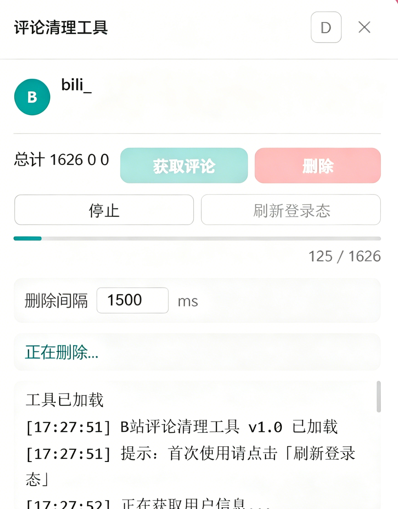

# BilibiliDelComment

> B站一键评论清理工具 -- 批量删除B站历史评论

## 功能

- 获取历史评论(aicu接口，评论不全)
- 批量删除
- 获取过程支持增量保留（部分失败不影响已获取的数据）

## 使用方法

### 1. 安装油猴脚本

需要浏览器已安装 [Tampermonkey](https://www.tampermonkey.net/) 扩展。

安装 `bilibili-comment-cleaner.user.js`

### 2. 打开B站

访问 `www.bilibili.com` 任意页面，登录你的账号。

### 3. 打开工具

页面右侧的绿色悬浮球，打开工具面板。

### 4. 删评论

点击面板中的「刷新登录态」，确认显示你的用户名和 UID。

点击「获取评论」，工具会自动拉取你的历史评论列表。获取过程中会显示进度，如果某页获取失败，已获取的部分仍然可用。

确认评论数量后，点击「删除」按钮，按提示确认即可开始批量删除。

删除间隔可以在设置中调整（默认 1500ms）。

## 数据来源

评论列表数据来自 `aicu.cc` 公开 API，如果 aicu.cc 不可用，自动降级到 B站消息中心接口（仅能获取有互动的评论）。

## 注意事项

- 删除操作不可恢复，建议先少量测试
- 删除间隔建议保持 1000ms 以上，避免触发风控
- 可在删除过程中随时点击「停止」中断

## 致谢

- [bilibili-comment-cleaning](https://github.com/Initsnow/bilibili-comment-cleaning)
- [bilibili-API-collect](https://github.com/SocialSisterYi/bilibili-API-collect)
- [BiliBili_Memory](https://github.com/EuDs63/BiliBili_Memory)
- [aicu.cc](https://www.aicu.cc/)

